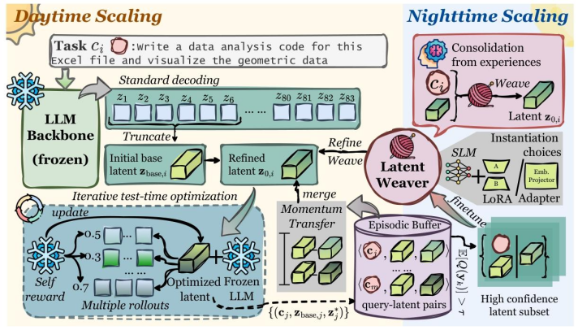

# LatentEvolve 笔记
LatentEvolve: Self-Evolving Test Time Scaling in Latent Space (ICLR 2026)
[https://openreview.net/forum?id=QTOYA4PFiJ](https://openreview.net/forum?id=QTOYA4PFiJ)

# 1. 概念

## 1.1 Complementary Learning System

- 海马体：快速编码单个具体的情景经验；
- 新皮层：缓慢整合经验并提炼通用结构化知识。

## 1.2 Test Time Scaling (TTS) 的四种实现形式

- Parallel Scaling 并行缩放：同时生成多条推理路径，然后通过投票等方式选一条最好的；
- Sequential Scaling 序列缩放：先初步给出答案，再基上一轮的输出，反复迭代优化；
- Hybrid Scaling 混合缩放：同时使用并行+序列；
- Internalized Scaling 内置缩放：模型自身动态调算力（如DeepSeek、GPT o1）。

已有的TTS方法存在的缺陷是：无法把对做上一道题的经验用于下一道题的求解上，无法自我进化。

# 2. 方法

## 2.1 在线推理Phase (海马体)

对于输入 $c_i$，首先使用Embedding模型获取其嵌入表示为 $e_{c_i}$：

$$
e_{c_i}=Emb(c_i)
$$

然后把 $c_i$ 输入 LLM，每次取最后一层Transformer的输出隐状态保存，最终获取隐状态序列，然后截取其开头固定长度为$L$的一段作为基础隐推理序列：

$$
z_{base,i}=H_θ(c_i)_{1:L}
$$

在这里，如果LatentWeaver模型$W_{\psi}$（将在2.2介绍）已经被训练，则$z_{base,i}$还需要进行一次优化：

$$
z_{base,i}=W_{\psi}(e_{c_i},z_{base,i})
$$

引入记忆库 $M$。记忆库中存储的是三元组 $\{e_c,z_{base},z^{*}\}$，其中$z^{*}$为优化后隐推理序列。根据输入嵌入表示$e_{c_i}$和记忆库中的其他输入嵌入表示$e_{c_i}$计算余弦相似度 $\text{S}(e_{c_i},e_{c_j})$， 经过Top-$k$筛选得到若干三元组。这些三元组即表示与当前需求解的问题相似的历史问题以及回答的优化方向。然后，对 $z_{base,i}$进行优化：

$$
z_{0,i}=z_{base}+\Sigma\alpha_{j}\Delta z_j,\alpha_j=e^{\text{S}(e_{c_i},e_{c_j})},\Delta z_j={z^*}_j-z_{base,j}
$$

如以上公式所示，根据问题的相似度使用隐推理序列的改进方向对 $z_{base,i}$进行加权优化，获得初始推理隐状态序列$z_{0,i}$。使用该隐状态输入LLM让其继续推理，为了保证评估的稳定性和真实性，多次采样获得 $N$ 条推理路径 $\textbf{y}=\{y_0,y_1,y_2,\cdots,y_N\}$。然后，采用模型自打分的方法（这种方法会引入噪声），对每条推理路径进行打分，获得平均分数 $Q(\textbf{y})$。目标函数为：

$$
J(z_{k,i})=E_{y\sim p(y|c_i,z_{k_i})}[Q(\textbf{y})].
$$

然后，对目标函数求隐推理序列 $z_{k,i}$的梯度$\nabla_{z_{k,i}}J(z_{k,i})$，从而实现对隐推理序列的迭代更新：

$$
z_{k+1,i}=z_{k,i}+\eta \nabla_{z_{k,i}}J(z_{k,i}),
$$

其中$\eta$为学习率。更新后，重复生成推理步骤、自评分、计算梯度、优化隐推理序列。这里使用两种停止迭代策略：到达一定步数后停止，以及连续评分上升差值不达到阈值。迭代结束后，获得$z^*_i$并把三元组存入$M$。

## 2.2 离线学习Phase (新皮层)

这部分的功能是使用一个小型语言模型$W_{\psi}$（LatentWeaver）对记忆库$M$ 中存储的经验进行学习。具体来说，对于每一个三元组，$W_{\psi}$接受的输入特征为$\{e_c,z_{base}\}$，监督标签为$z^*$。触发离线学习的条件是：$M$中存储的三元组数量达到触发阈值$K$。训练完成后，清空记忆库$M$。